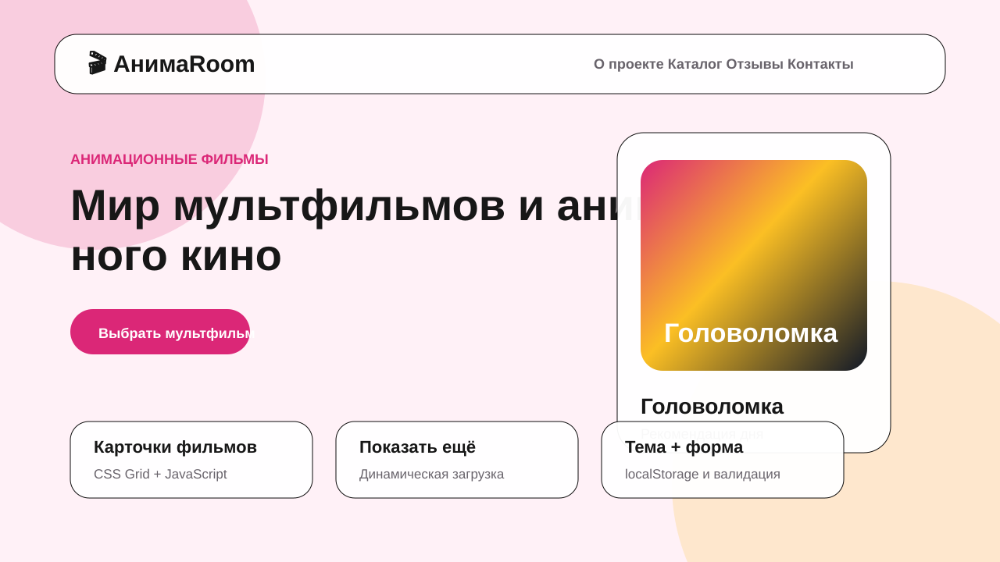

# АнимаRoom — итоговый проект по JavaScript

## Описание

**АнимаRoom** — одностраничный сайт-лендинг на тему: анимационные фильмы.

Проект сделан как итоговая работа по курсу JavaScript. На сайте есть шапка, главный экран, блок преимуществ, каталог с карточками фильмов, отзывы, форма обратной связи и подвал.

## Реализовано

- Семантическая структура HTML: `header`, `main`, `section`, `footer`.
- Навигация по разделам страницы.
- Блок с карточками фильмов.
- Сетка карточек на CSS Grid.
- Адаптивная верстка под мобильные устройства.
- Фильтрация карточек по жанрам.
- Кнопка **«Показать ещё»**, которая добавляет карточки динамически.
- Переключение светлой и тёмной темы.
- Сохранение выбранной темы в `localStorage`.
- Форма обратной связи.
- Проверка имени, email и сообщения.
- Вывод данных формы в `console.log`.

## Использованные технологии

- HTML5
- CSS3
- Flexbox
- CSS Grid
- JavaScript
- localStorage

## Структура проекта

```text
07_animation_room/
├── index.html
├── styles.css
├── script.js
├── screenshot.svg
└── README.md
```

## Как запустить

1. Скачайте папку проекта.
2. Откройте файл `index.html` в браузере.
3. Для проверки формы откройте консоль разработчика и отправьте форму.

## Публикация на GitHub Pages

1. Создайте новый репозиторий на GitHub.
2. Загрузите файлы проекта в репозиторий.
3. Перейдите в **Settings → Pages**.
4. В качестве источника выберите ветку `main` и папку `/root`.
5. Сохраните настройки и дождитесь публикации сайта.

## Скриншот



## Автор

Учебный проект по JavaScript.
